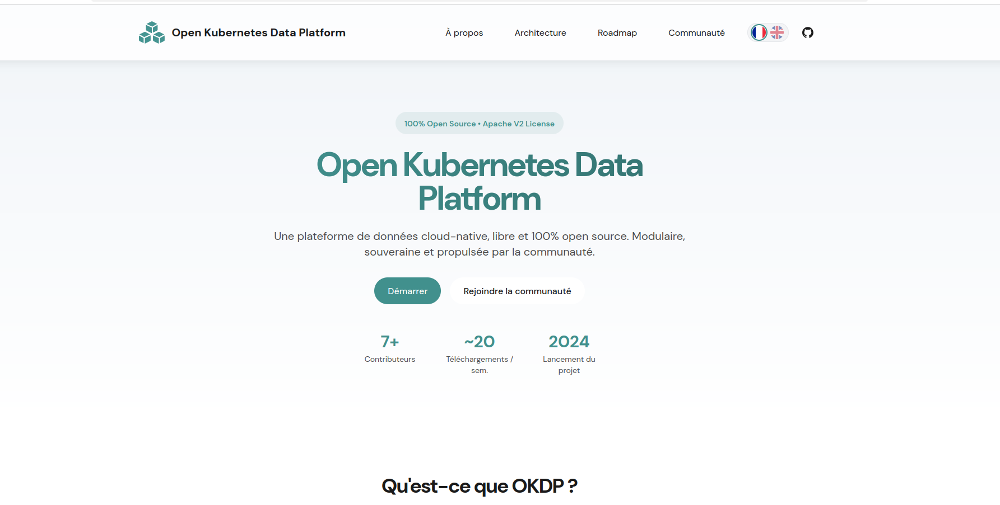

# OKDP.io

[](https://opensource.org/licenses/Apache-2.0)
[](https://okdp.io)



**Website for [OKDP](https://okdp.io) (Open Kubernetes Data Platform).**
A free, open-source, cloud-native data platform built on Kubernetes. Modular, sovereign, and community-driven.

> Roadmap: [Roadmap](https://okdp.io/roadmap/)

---
## About the Site

This repository contains the source of the **okdp.io** marketing website, a bilingual (FR/EN) static site showcasing the OKDP platform, its architecture, modules, and roadmap.

**Stack**
- [Vite](https://vitejs.dev/): build tool
- [Handlebars](https://handlebarsjs.com/): HTML templating 
- [Tailwind CSS](https://tailwindcss.com/): Utility first styling
- Custom SSG script (`scripts/generate.js`) for i18n-driven template compilation

**Features:**
- Bilingual support: French (default) and English (`/en`)
- Multi-page: Home + Roadmap, each in both languages
- OKDP module showcase with technology logos (Spark, Trino, Kafka, Iceberg, Airflow, and more)
- Responsive, mobile-first design

---

## Development

```bash
# Install dependencies
npm install

# Generate HTML from templates, then start the dev server
npm run dev
```

`npm run dev` runs two steps in sequence:
1. `npm run generate`: compiles Handlebars templates with locale data from `src/locales`
2. `vite`: starts the dev server with hot reload

## Build

```bash
npm run build   # generate + vite build -> outputs to dist/
npm run preview # preview the production build locally
```

---

## Project Structure

```
src/
    locales/               # i18n translation files (en.json, fr.json) 
    template.html          # Handlebars template: home page 
    roadmap-template.html  # Handlebars template: roadmap page 
    partials/              # Reusable HTML partials (header, footer, scripts) 
    index.css              # Tailwind CSS entry point 
scripts/                    
    generate.js            # Template compilation script 
public/
    logos/                 # Technology logos (Spark, Trino, Kafka, Iceberg, etc.) 
    flags/                 # Language flag icons 
```

---

### Community

- Organization: [TOSIT Association](https://tosit.fr)
- Communication: [Github discussion](https://github.com/orgs/OKDP/discussions)
